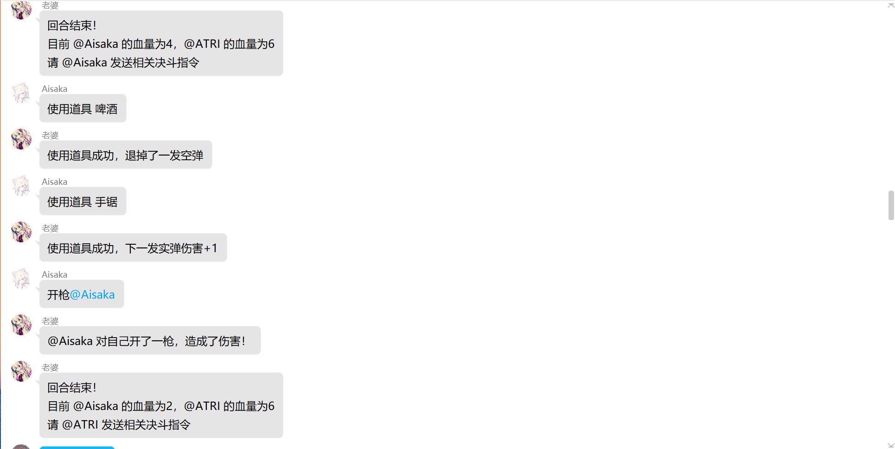
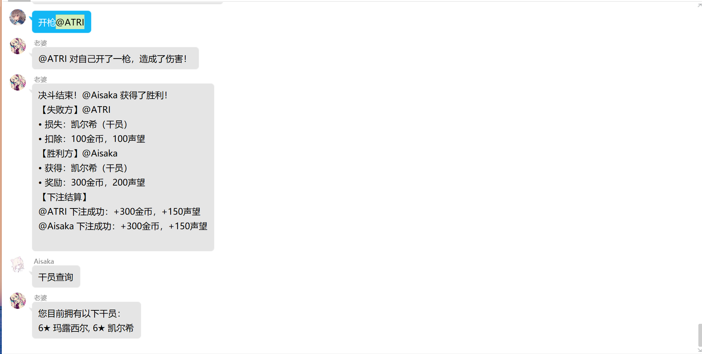

# nonebot-plugin-NobleDuel 贵族决斗小游戏插件

> **注意**：本插件所有代码均为 AI 开发，可能存在部分 bug，欢迎有能力的用户自行修改优化代码。  
> **玩法灵感来源**：[PcrDuel项目](https://github.com/Rs794613/PcrDuel)  
> 这是一个老项目了，以前觉得很好玩但是本人又不会写代码所以只能靠AI了，还有很多好玩的功能没有实现，后续优化全看AI给不给力。

## 依赖（自动安装）

- nonebot-plugin-alconna
- nonebot-plugin-apscheduler
- nonebot-plugin-localstore

## 安装

使用 nb-cli 安装（推荐）：
```bash
nb plugin install nonebot-plugin-NobleDuel
```
使用 pip 安装（PyPI）：
```bash
pip install nonebot-plugin-NobleDuel
```

## 游戏概述

贵族决斗是一款基于 QQ 群的文字互动游戏，玩家通过创建贵族身份、招募干员、参与决斗等方式进行游戏。游戏包含经济系统、干员养成、决斗对战等核心玩法。

---

## 基础系统

### 1. 贵族身份系统
- **创建贵族**：使用指令 `创建贵族` 初始化玩家身份
- **爵位等级**：从男爵到皇帝共 7 个等级，随声望提升
- **每日签到**：使用 `贵族签到` 获取每日奖励（300-400 金币，150-250 声望）

### 2. 经济系统
- **金币**：用于招募干员、购买礼物、参与决斗等
- **声望**：用于提升爵位等级
- **获取途径**：
  - 每日签到
  - 决斗胜利
  - 连胜奖励

### 3. 明日方舟干员系统
- **星级划分**：1-6 星干员，星级越高越稀有
- **招募方式**：使用 `招募干员` 花费 300 金币随机获取
- **数量限制**：随爵位提升（男爵 10 个→皇帝 35 个）
- **好感度**：通过赠送礼物提升

---

## 决斗系统（恶魔轮盘低配版）

### 1. 决斗流程
1. **发起决斗**：`贵族决斗 @目标`（消耗 100 金币 + 50 声望）
2. **接受/拒绝**：目标玩家需在 30 秒内回应
3. **下注阶段**：其他玩家可 `下注 @选手`（消耗 200 金币）
4. **对战阶段**：轮流使用道具和开枪

### 2. 决斗规则
- **生命值**：初始 6 点
- **回合制**：每局包含若干回合
- **子弹机制**：
  - 实弹：造成伤害
  - 空弹：无伤害
  - 每局子弹配置随机生成

### 3. 道具系统
| 道具名称   | 效果描述                     | 获取概率 |
|----------|----------------------------|--------|
| 放大镜   | 查看下一发子弹类型             | 25%   |
| 香烟     | 回复 1 点生命值               | 20%   |
| 手铐     | 跳过对手下一回合               | 15%   |
| 手锯     | 下一发实弹伤害 +1              | 15%   |
| 啤酒     | 退膛当前子弹                   | 15%   |
| 逆转器   | 转换当前子弹类型               | 5%    |
| 肾上腺素 | 偷取并使用对手道具             | 3%    |
| 过期药   | 50% 回复 2 血 / 50% 扣 1 血    | 2%    |
| 一次性手机 | 随机提示弹仓子弹类型           | 1%    |

### 4. 胜负判定
- 生命值先归零者败
- 胜利奖励：
  - 金币 +400
  - 声望 +200
  - 随机获得对方 1 个干员
- 失败惩罚：
  - 金币 -300
  - 声望 -100
  - 随机失去 1 个干员

### 5. 连胜奖励
- 3 连胜：额外 200 金币 + 100 声望
- 5 连胜：额外 500 金币 + 200 声望
- 10 连胜：额外 2000 金币 + 600 声望

---

## 干员养成系统

### 1. 礼物赠送
| 礼物名称   | 好感度增加 | 价格   |
|----------|---------|------|
| 玩偶     | +5      | 10 金币 |
| 礼服     | +10     | 20 金币 |
| 歌剧门票 | +15     | 30 金币 |
| 鲜花     | +50     | 100 金币 |
| ...      | ...     | ...  |

**指令**：`礼物 礼物名 干员名`

### 2. 干员管理
- **解雇干员**：`解雇 干员名`（消耗 200 金币）
- **查询干员**：`干员查询`
- **好感查询**：`好感度查询` / `好感度查询 干员名`

---

## 经济系统指令
- **购买礼物**：`购买礼物 礼物名`
- **礼物查询**：`礼物查询`
- **金币充值**（群主专属）：`充值金币 @用户 数量`

---

## 指令总览

- 创建贵族
- 贵族查询
- 贵族签到
- 升级爵位
- 贵族排行
- 招募干员
- 干员查询
- 好感度查询
- 好感度查询 干员名
- 解雇 干员名
- 购买礼物 礼物名
- 礼物查询
- 道具介绍
- 礼物 礼物名 干员名
- 贵族决斗 @用户
- 接受决斗 / 拒绝决斗
- 下注 @用户
- 开枪 @目标
- 使用道具 道具名
- 道具查询
- 重置决斗
- 充值金币 @用户 数量（仅群主可用）

---




